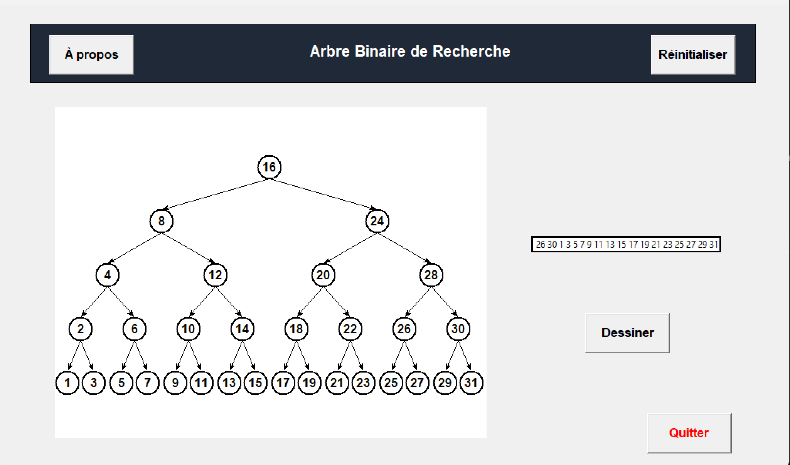

# Arbre Binaire de Recherche (ABR) - Visualiseur Python

## Fonctionnalités

Insertion dynamique : Ajout de nœuds avec des valeurs comprises entre 1 et 99.

Visualisation graphique : Rendu visuel de l'arbre sur un canevas (Tkinter).

Gestion des limites : L'arbre est limité à une hauteur de 4 pour garantir la lisibilité.

Interface intuitive : Boutons Dessiner, Réinitialiser et Quitter.

Sécurité : Gestion des erreurs de saisie (valeurs non traitables ou hors limites).

## Stack Technique

Langage : Python 3

Interface Graphique : Tkinter

Paradigme : Programmation Orientée Objet (POO)

## Structure du Code

Le projet s'appuie sur trois classes principales :

Classe Noeud : Définit l'unité de base de l'arbre (valeur, fils gauche, fils droit).

Classe ArbreBinaire : Gère la logique de l'arbre (méthode d'insertion, calcul de hauteur).

Classe Application : Gère l'interface graphique, les événements et le tracé des nœuds/liens.

## Aperçu des Tests

Le programme a été validé avec les cas suivants :

Insertion de valeurs multiples respectant la logique de l'ABR (inférieur à gauche, supérieur à droite).

Blocage automatique à la hauteur 4 avec message d'alerte.

Nettoyage complet du canevas via le bouton Réinitialiser.
